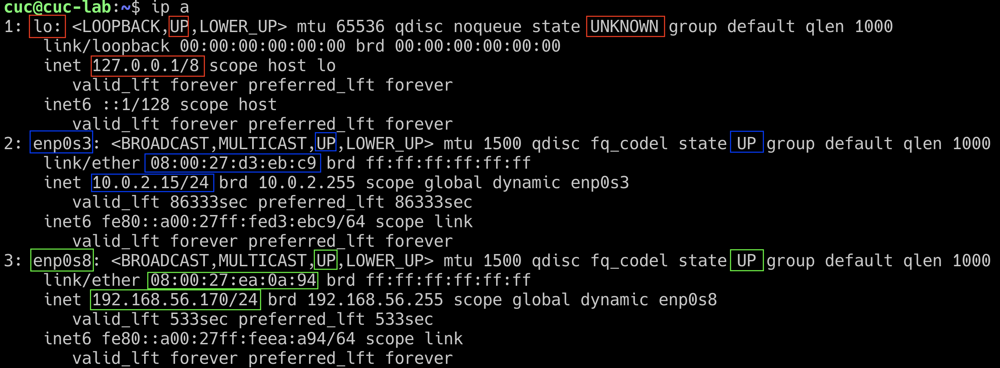
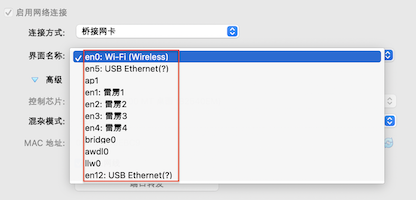
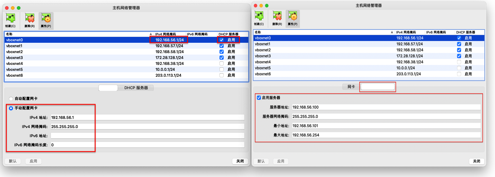
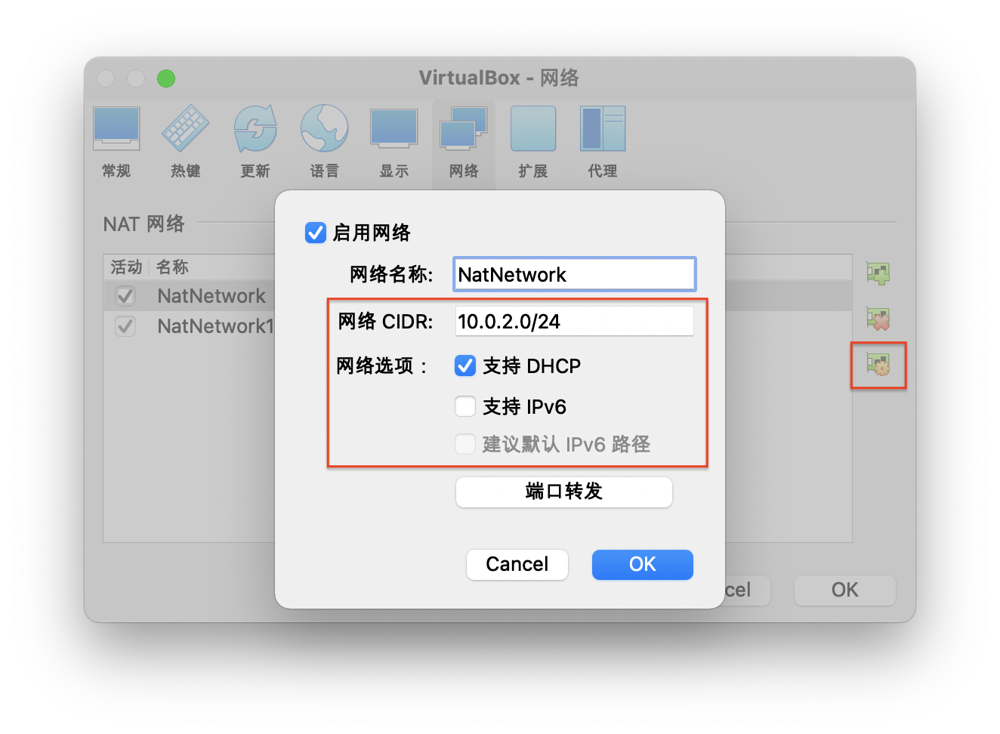
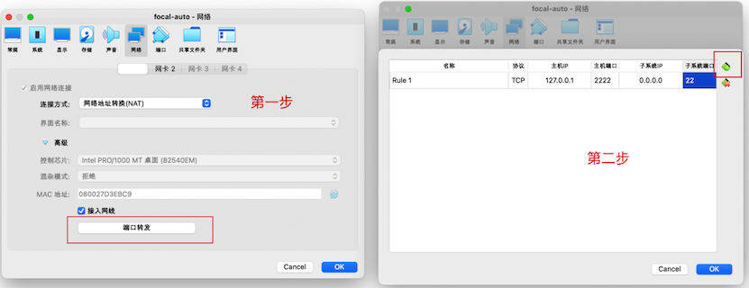
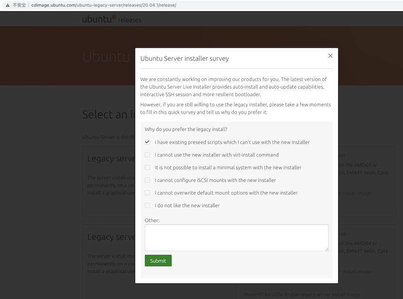

# 第一章：Linux基础（实验）

---

##  GNU is NOT Unix

# 软件环境

---

* Virtualbox
* Ubuntu 20.04 Server 64bit
    * 备选：Ubuntu 18.04 Server 64bit
    * 备选：Ubuntu 18.04 Desktop 64bit
* 课件内容均在 18.04 版本时代制作，同学们在实验时遇到实际情况与课件描述不符之处，应以实际环境为准，切忌唯课件论

# 实验问题

---

* 如何配置无人值守安装iso并在Virtualbox中完成自动化安装。
* Virtualbox安装完Ubuntu之后新添加的网卡如何实现系统开机自动启用和自动获取IP？
* 如何使用sftp在虚拟机和宿主机之间传输文件？


# 实验报告要求

---

* 使用 `markdown` 格式纯文本
* 使用 [Github Classroom](https://classroom.github.com/classrooms) 管理作业（课堂当日宣讲为准）
* 每次作业应 `commit` 到独立分支并通过 `Pull Request` 分别提交每一次作业
* 实验报告应图文并茂的记录实验过程，证明自己独立完成的实验作业
* 记录自己独立解决的问题和解决办法，并给出问题解决用到的参考资料出处、链接

# 参考文献

---

* [No “eth0” listed in ifconfig -a, only enp0s3 and lo](http://askubuntu.com/questions/704035/no-eth0-listed-in-ifconfig-a-only-enp0s3-and-lo)


# 关于查看虚拟机 IP 地址的 FAQ {id="howto-get-vm-ips"}

---

## ip a {id="ip-a-1"}



---

## ip a {id="ip-a-2"}

| 接口名称 | 网卡类型 | 网卡标识 | IP 地址/子网掩码  | MAC 地址          | 物理层正常可用状态 |
| :-       | :-       | :-       | :-                | :-                | :-                 |
| 回环接口 | 虚拟网卡 | lo       | 127.0.0.1/8       | 00:00:00:00:00:00 | UNKNOWN            |
| 以太网卡 | 物理网卡 | enp0s3   | 10.0.2.15/24      | 08:00:27:d3:eb:c9 | UP                 |
| 以太网卡 | 物理网卡 | enp0s8   | 192.168.56.170/24 | 08:00:27:ea:0a:94 | UP                 |

---

## 不同视角的物理网卡 {id="vnic-by-views"}

* 宿主机（`Host OS`）视角 



* 虚拟机（客户机系统, `Guest OS`）视角
    * 上述 `ip a` 输出结果里的 `enp0s3` 和 `enp0s8`

---

## 不同视角的虚拟网卡 {id="vnic-by-views"}

* 宿主机（`Host OS`）视角


* 虚拟机（客户机系统, `Guest OS`）视角
    * 上述 `ip a` 输出结果里的 `lo`

---

## Host-only 网络默认分配 IP 地址范围



---

## NAT 默认分配 IP 地址 {id="nat-ip-config"}

10.0.2.15/24

---

## 「NAT 网络」默认分配 IP 地址 {id="natnetwork-ip-config"}



---

## 如果你的 Host-only 网络无法正常使用 {id="nat-portfwd"}



* 开启 `端口转发` 后，就可以  `ssh cuc@127.0.0.1 -p 2222` 登录 Linux
    * 如果宿主机上 `2222` 端口已经被占用，请更换为其他可用端口号（建议 1024 以上）
* `NAT` 或 `NAT 网络` 创建的虚拟网卡对应的虚拟机内地址不能在宿主机上直接访问到

# Focal Fossa 无人值守安装 iso 制作过程示例

---

⚠️ 仅适用于基于 [subiquity](https://github.com/CanonicalLtd/subiquity) 的 Ubuntu 安装镜像 ⚠️

* [Ubuntu 20.04 Live Server](https://releases.ubuntu.com/focal/)
    * 当前已验证 [20.04.2](https://releases.ubuntu.com/focal/ubuntu-20.04.2-live-server-amd64.iso)

---

## 先修但可以跳过的技术基础

[Cloud-Init](cloud-init.md)

---

## 实现特性

* 定制一个普通用户名和默认密码
* 定制安装 OpenSSH Server

---

## 实验提醒

* 根据需要 **酌情** 修改指令
* 遇到指令执行出错务必 **仔细** 阅读出错信息并在搜索引擎中搜索 **错误关键字**

---

## 主要操作步骤 {id="steps-to-auto-focal-1"}

* 提前下载好[纯净版 Ubuntu 安装镜像 iso 文件](https://releases.ubuntu.com/focal/ubuntu-20.04.2-live-server-amd64.iso)
* 使用手动安装 Ubuntu 后得到的一个初始「自动配置描述文件」 :  `/var/log/installer/autoinstall-user-data` 对照 [Ubuntu 20.04 + Autoinstall + VirtualBox](https://gist.github.com/bitsandbooks/6e73ec61a44d9e17e1c21b3b8a0a9d4c) 中提供的示例配置文件 **酌情修改**
    * 也可以 **偷懒跳过** 上述步骤，直接使用我提供的一个 [可用配置文件 user-data](exp/chap0x01/cd-rom/nocloud/user-data)
    * `meta-data` 文件必不可少，但可以是空文件
* 同手工安装系统步骤，新建可以用于安装 `Ubuntu 64位系统` 的虚拟机配置

---

## 主要操作步骤 {id="steps-to-auto-focal-2"}

* 参考 [番外章节 Cloud-Init 实验目录中的说明文件](exp/cloud-init/docker-compose/README.md) ，制作包含 `user-data` 和 `meta-data` 的 ISO 镜像文件，假设命名为 `focal-init.iso`
* 移除上述虚拟机「设置」-「存储」-「控制器：IDE」
* 在「控制器：SATA」下新建 2 个虚拟光盘，**按顺序** 先挂载「纯净版 Ubuntu 安装镜像文件」后挂载 `focal-init.iso`
* 启动虚拟机，稍等片刻会看到命令行中出现以下提示信息。此时，需要输入 `yes` 并按下回车键，剩下的就交给「无人值守安装」程序自动完成系统安装和重启进入系统可用状态了

> Continue with autoinstall? (yes|no)

# (2021 年以前版本) 无人值守安装iso制作过程示例 

---

⚠️ 仅限 Ubuntu 18.04 和 16.04 ，不适用于 Ubuntu 20.04 及后续更新版本 ⚠️

---

## Ubuntu 20.04 Legacy 版 {id="focal-legacy"}

[](http://cdimage.ubuntu.com/ubuntu-legacy-server/releases/20.04.1/release/)

---

## 实现特性 {id="features-2020"}

* 定制一个普通用户名和默认密码
* 定制安装OpenSSH Server
* 安装过程禁止自动联网更新软件包

---

## 实验提醒 {id="tips-2020"}

* 先「有人值守」方式安装好 **一个可用的 Ubuntu 系统环境**
* 以下操作指令均在上述环境的 **命令行** 中输入完成
* 根据需要 **酌情** 修改指令
* 遇到指令执行出错务必 **仔细** 阅读出错信息并在搜索引擎中搜索 **错误关键字**

---

```bash
# 根据实际情况，自行替换其中的参数
# 在当前用户目录下创建一个用于挂载iso镜像文件的目录
mkdir loopdir

# 挂载iso镜像文件到该目录
mount -o loop ubuntu-16.04.1-server-amd64.iso loopdir

# 创建一个工作目录用于克隆光盘内容
mkdir cd
 
# 同步光盘内容到目标工作目录
# 一定要注意loopdir后的这个/，cd后面不能有/
rsync -av loopdir/ cd

# 卸载iso镜像
umount loopdir

# 进入目标工作目录
cd cd/

# 编辑Ubuntu安装引导界面增加一个新菜单项入口
vim isolinux/txt.cfg
```

---

添加以下内容到该文件后强制保存退出

```
label autoinstall
  menu label ^Auto Install Ubuntu Server
  kernel /install/vmlinuz
  append  file=/cdrom/preseed/ubuntu-server-autoinstall.seed debian-installer/locale=en_US console-setup/layoutcode=us keyboard-configuration/layoutcode=us console-setup/ask_detect=false localechooser/translation/warn-light=true localechooser/translation/warn-severe=true initrd=/install/initrd.gz root=/dev/ram rw quiet
```

---


* 提前阅读并编辑定制Ubuntu官方提供的示例[preseed.cfg](https://help.ubuntu.com/lts/installation-guide/example-preseed.txt)，并将该文件保存到刚才创建的工作目录``~/cd/preseed/ubuntu-server-autoinstall.seed``
* 修改isolinux/isolinux.cfg，增加内容``timeout 10``（可选，否则需要手动按下ENTER启动安装界面）

---

```bash
# 切换到 root 用户身份
sudo su -

# 重新生成md5sum.txt
cd "$HOME/cd" && find . -type f -print0 | xargs -0 md5sum > md5sum.txt

# 封闭改动后的目录到.iso
IMAGE=custom.iso
BUILD="$HOME/cd/"

apt update && apt install -y genisoimage
genisoimage -r -V "Custom Ubuntu Install CD" \
            -cache-inodes \
            -J -l -b isolinux/isolinux.bin \
            -c isolinux/boot.cat -no-emul-boot \
            -boot-load-size 4 -boot-info-table \
            -o $IMAGE $BUILD

# 如果目标磁盘之前有数据，则在安装过程中会在分区检测环节出现人机交互对话框需要人工选择
```

---

一个我修改定制好的[ubuntu-server-autoinstall.seed](exp/chap0x01/cd-rom/preseed/ubuntu-server-autoinstall.seed)，请自行和官方示例文件进行比对，自行思考理解和掌握：

* 我做了哪些修改？
    * 用什么「工具」能提高「差异」比对的效率？
* 这些修改的作用是什么？

---

## 友情提醒 {id="tips-2020-1"}

* preseed 的方法一定要用 ubuntu-18.04.1-server-amd64.iso 不能用 [ubuntu-18.04.1-live-server-amd64.iso](https://askubuntu.com/questions/1063393/error-creating-custom-install-of-ubuntu-18-04-live-server)
* txt.cfg 中我们添加的自动安装菜单选项一定要「置顶」，不能通过修改文件首行 default 参数的取值来实现自动选中菜单开始安装系统的目的

---

## 推荐阅读

* [在 VirtualBox 中一键安装 macOS](https://github.com/myspaghetti/macos-virtualbox)
    * 命令行操作 VirtualBox 的最佳示范应用
    * 跨平台 Bash 脚本的最佳示范应用（建议学完「第四章」后再看、再学习体会）
    * 获得 macOS 平台体验机会

